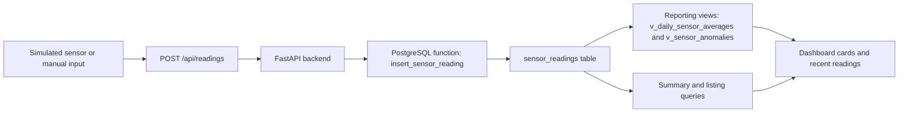

# Project Explainer for Exercise 5

This project is a beginner-friendly example of an IoT data logging system. In simple terms, it shows how data from sensors can be collected, stored in a database, checked for unusual values, and displayed in a dashboard. Even though the project is about IoT, this repository mostly focuses on the software side of the work: the database, the backend API, the reporting logic, and the small web dashboard.

It is important to understand one thing early: this repository simulates an IoT workflow. It does not contain physical sensors, embedded device code, a hardware gateway, or a message broker such as MQTT. Instead, it uses sample data and API requests to represent what real sensors would normally send.

## IoT in simple terms

Here are the key ideas in plain English:

- **IoT**: Internet of Things. It means physical devices collect data and send it to software systems over a network.
- **Sensor**: A device that measures something, such as temperature or humidity.
- **Reading**: One measurement captured by a sensor at a specific time.
- **Location**: The place where a sensor is installed, such as a greenhouse or warehouse.
- **Anomaly**: A reading that looks abnormal, such as a temperature that is too high or a sudden spike.
- **API**: A set of web endpoints that allow software to send or fetch data.
- **Dashboard**: A web page that shows important information in a simple visual form.
- **Database**: The system that stores all the sensor, location, and reading data.
- **Seed data**: Sample records inserted into the database so the system has demo data to work with.

## What this project is

This repository implements Exercise 5 as an IoT data logging database project. Its job is to manage environmental readings like temperature and humidity, store them in PostgreSQL, and produce useful outputs such as daily averages, anomaly reports, and summary statistics. The project is designed to show how a data-driven IoT application can be modeled and queried, even without building the physical hardware side.

## Main components

### 1. PostgreSQL database

The PostgreSQL database is the center of the project. Everything else depends on it.

Its main responsibilities are:

- storing the list of monitored places
- storing the sensors installed at those places
- storing the readings those sensors produce over time
- generating summary views and anomaly reports

In a real IoT solution, many devices may send data continuously. That means the database must handle time-based data efficiently. This project reflects that by using a time-series style table design and indexes optimized for date-range queries.

### 2. Database schema objects

The schema in [sql/01_schema.sql](/Users/i.obanijesu/Downloads/iot_logger_app/sql/01_schema.sql) defines the core database objects.

#### `locations`

This table stores the places where sensors are installed.

Examples from the sample data:

- Greenhouse A
- Warehouse 1
- Clinic Ward

Each location can include a name, description, latitude, longitude, and creation timestamp.

#### `sensors`

This table stores the devices or logical sensor definitions attached to a location.

Each sensor has:

- a unique `sensor_code`
- a `location_id` linking it to a location
- a `sensor_type`
- minimum and maximum thresholds for temperature
- minimum and maximum thresholds for humidity
- an active flag and install timestamp

These threshold values matter because the system uses them later to decide whether a reading is normal or abnormal.

#### `sensor_readings`

This is the main time-series table. It stores the actual measurements captured by sensors.

Each reading contains:

- which sensor produced it
- when it was recorded
- the temperature value
- the humidity value

This table is partitioned by month. That means PostgreSQL stores readings in monthly chunks behind the scenes. This helps performance when the data grows larger over time.

#### `v_daily_sensor_averages`

This is a database view. A view is like a saved query.

Its purpose is to calculate daily average temperature and humidity per sensor and per location. Instead of doing that calculation manually every time from the API, the database provides a ready-made report.

#### `v_sensor_anomalies`

This is another database view. It identifies readings that should be treated as unusual.

It detects:

- temperature threshold breaches
- humidity threshold breaches
- sudden temperature spikes
- sudden humidity spikes

This gives the application a simple way to ask, "Which readings look suspicious or important?"

#### `insert_sensor_reading`

This is a PostgreSQL function used when a new reading is submitted.

Its job is to:

1. look up a sensor by `sensor_code`
2. convert that sensor code into the internal `sensor_id`
3. insert the new reading into `sensor_readings`
4. return the inserted reading ID

This is helpful because the API can work with a human-friendly sensor code like `GH-A-001` instead of forcing the user to know the database primary key.

### 3. FastAPI backend

The backend lives mainly in [app/main.py](/Users/i.obanijesu/Downloads/iot_logger_app/app/main.py). It exposes REST endpoints that read from and write to the database.

These are the current public interfaces:

- `/api/locations`
  - `GET` returns all locations
  - `POST` creates a new location
- `/api/sensors`
  - `GET` returns sensors, optionally filtered by location
  - `POST` creates a new sensor
- `/api/readings`
  - `GET` returns readings, optionally filtered by sensor and time range
  - `POST` inserts a new reading by sensor code
- `/api/reports/daily-averages`
  - `GET` returns daily average readings from the reporting view
- `/api/reports/anomalies`
  - `GET` returns abnormal readings from the anomaly view
- `/api/reports/summary`
  - `GET` returns headline metrics such as total readings, active sensors, averages, and per-sensor summaries

The backend acts like the translator between the browser or any client and the database. It receives requests, runs SQL, and returns structured JSON.

### 4. Dashboard UI

The dashboard is made of:

- [app/templates/index.html](/Users/i.obanijesu/Downloads/iot_logger_app/app/templates/index.html)
- [app/static/app.js](/Users/i.obanijesu/Downloads/iot_logger_app/app/static/app.js)

It is a simple web interface for understanding the system without needing to call every API manually.

The dashboard shows:

- total readings
- active sensors
- average temperature
- average humidity
- recent readings
- detected anomalies
- daily averages

It also includes a form for inserting a new sensor reading. When you submit the form, the page sends a `POST` request to `/api/readings`, then refreshes the displayed data.

### 5. Bootstrap and reseed services

The Docker Compose setup includes helper services that deal with database setup.

In [docker-compose.yml](/Users/i.obanijesu/Downloads/iot_logger_app/docker-compose.yml):

- `init-db` tries to connect to the configured PostgreSQL database, apply the schema, and load seed data if the database is empty
- `seed-db` is a separate helper used to reset the demo tables and load the sample data again
- `api` runs the FastAPI application

The related shell scripts are:

- [scripts/init_db.sh](/Users/i.obanijesu/Downloads/iot_logger_app/scripts/init_db.sh)
- [scripts/seed_db.sh](/Users/i.obanijesu/Downloads/iot_logger_app/scripts/seed_db.sh)

These services are not part of IoT itself. They are project setup tools that help prepare the database for development or demonstration.

### 6. `.env` configuration and database connection

The application reads database settings from [app/config.py](/Users/i.obanijesu/Downloads/iot_logger_app/app/config.py), which loads values from `.env`.

Important values include:

- `DB_HOST`
- `DB_PORT`
- `DB_NAME`
- `DB_USER`
- `DB_PASSWORD`
- `APP_PORT`

The backend uses these settings to open a PostgreSQL connection in [app/db.py](/Users/i.obanijesu/Downloads/iot_logger_app/app/db.py).

This is how the application knows:

- which database server to contact
- which database to use
- which user credentials to send

Without this configuration, the API would not know where the data lives.

### 7. Sample seed data

The seed script in [sql/02_seed.sql](/Users/i.obanijesu/Downloads/iot_logger_app/sql/02_seed.sql) creates demo data so the system has something meaningful to display.

It inserts:

- sample locations
- sample sensors
- several days of generated readings
- a few intentionally abnormal readings

This is useful because it demonstrates how the project behaves in a realistic scenario. For example, the anomaly report becomes meaningful only when some readings exceed thresholds or change sharply.

## How everything connects

The easiest way to understand this project is to follow the path of a reading.



In words, the flow is:

1. A sensor reading appears.
   In this project, that usually means one of two things:
   a seeded reading already exists in the database, or a user submits a reading through the form or API.
2. The backend receives the reading through `/api/readings`.
3. The database function `insert_sensor_reading` finds the correct sensor and stores the new measurement.
4. The reading becomes part of the historical data in `sensor_readings`.
5. Reporting logic uses that stored data to build:
   - daily averages
   - anomaly lists
   - summary statistics
6. The dashboard requests those reports from the API and displays them in a way a user can quickly understand.

## What is simulated vs real in this repo

This point matters a lot for a beginner.

### What is real in the repository

The following parts are fully implemented software:

- the PostgreSQL database design
- the tables, views, indexes, and function
- the FastAPI backend
- the REST endpoints
- the dashboard page
- the reporting and anomaly logic
- the setup and reseed helper scripts

### What is simulated

The following parts of a typical IoT solution are represented only in a simplified way:

- physical sensors are represented by rows in the `sensors` table
- live sensor transmissions are represented by seeded records or manual/API submissions
- a hardware device or controller is not implemented
- a gateway is not implemented
- a streaming transport or message broker is not implemented

So when you use this project, think of it as "the data platform and application layer for IoT," not the hardware layer.

## Example walkthrough

Here is a simple example using the seeded sensor code `GH-A-001`.

1. `GH-A-001` represents a sensor installed at **Greenhouse A**.
2. The sensor has temperature and humidity thresholds stored in the `sensors` table.
3. A reading is submitted, for example:

```json
{
  "sensor_code": "GH-A-001",
  "recorded_at": "2026-03-18T12:30:00Z",
  "temperature": 31.4,
  "humidity": 67.5
}
```

4. The backend receives this request through `POST /api/readings`.
5. PostgreSQL uses `insert_sensor_reading` to look up `GH-A-001` and insert the new row into `sensor_readings`.
6. Later, if a report is requested:
   - `/api/reports/daily-averages` includes the reading in that day's averages
   - `/api/reports/anomalies` checks whether the reading breaks thresholds or shows a sudden spike
   - `/api/reports/summary` includes it in totals and averages
7. The dashboard fetches those results and shows them to the user.

This is the core story of the whole system: capture a reading, store it, analyze it, and present the result.

## Why this project still matters if you do not know IoT

You do not need to be an IoT specialist to understand this repository. A good way to think about it is:

- the "IoT" part explains where the data conceptually comes from
- the database stores that data in a structured way
- the backend exposes it through web APIs
- the dashboard helps humans inspect and understand it

If you understand forms, APIs, tables, and reports, you can already understand most of this project.

## Glossary

- **API endpoint**: A specific URL that performs one backend action.
- **Backend**: The server-side application that handles requests and talks to the database.
- **Dashboard**: A web page that summarizes important information.
- **Database view**: A saved query that behaves like a virtual table.
- **Humidity**: The amount of moisture in the air.
- **IoT**: A system where physical devices collect data and share it with software systems.
- **Location**: The place where a sensor is installed.
- **Partitioning**: Splitting a large table into smaller sections, often by time, to improve performance.
- **Reading**: One sensor measurement captured at a specific time.
- **Seed data**: Sample records inserted to make the system easier to test or demonstrate.
- **Sensor**: A device or logical source that produces measurements.
- **Threshold**: A limit used to decide whether a reading is normal or abnormal.
- **Time-series data**: Data recorded over time, usually with timestamps.
